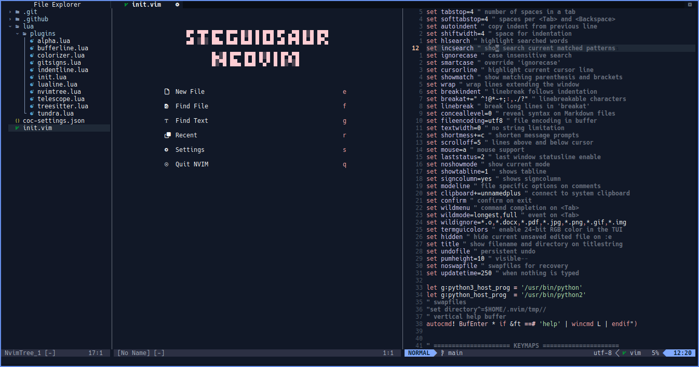

# :hatching_chick: NEOVIM Config

**Personal Neovim configuration with Markdown and LaTeX previewer.**
**Compatible with Termux and Linux.**



---

## :gear: Features

> Configurable under `~/.config/nvim/init.vim`

- Preview LaTeX using Zathura
- Preview Markdown, UML, etc. in default browser

**Aesthetics**

- Buffer - `akinsho/bufferline.nvim`
- Statusline - `nvim-lualine/lualine.nvim`
- Icons - `kyazdani42/nvim-web-devicons`
- Colorscheme - `sam4llis/nvim-tundra`

**Functionality**

- Start Prompt - `goolord/alpha-nvim`
- Indentation - `lukas-reineke/indent-blankline.nvim`
- Auto Pairing - `jiangmiao/auto-pairs`
- Tags - `preservim/tagbar`
- Command - `folke/which-key.nvim`

**File Explorer**

- Nvim Tree - `kyazdani42/nvim-tree.lua`
- Telescope - `nvim-telescope/telescope.nvim`

**Completion, Linters, and Syntax Highlighting**

- LSP - `neoclide/coc.nvim`
- LaTeX - `lervag/vimtex`
- Syntax Highlighting - `nvim-treesitter/nvim-treesitter`
- Color Value Highlighter - `norcalli/nvim-colorizer.lua`

**Git**

- Git Command Mode - `tpope/vim-fugitive`
- Gutter Changes - `lewis6991/gitsigns.nvim`

## :hammer_and_wrench: Setup

### Required

- Neovim
- Git
- [Vim-Plug (Plugin Manager)](https://github.com/junegunn/vim-plug )
- Ctags (for :TagbarToggle)

### Installation

To get started, install git, neovim, and ctags:

> Debian based distro & Termux

```shell
apt install git neovim ctags
```

> Arch based distro

```shell
pacman -S git neovim ctags
```

Then install the plugin manager (preferably Vim-plug):

> Read documentation on how to install.

- [Vim-Plug](https://github.com/junegunn/vim-plug ) plugin manager

Clone the repository to $HOME/.config/nvim

```console
git clone https://github.com/steguiosaur/nvim.git ~/.config/nvim
```

Install plugins by executing the command `:PlugInstall` in command mode
or the one below in the command line:

```shell
nvim +PlugInstall
```

### Language Server Installation

This config uses [coc.nvim](https://github.com/neoclide/coc.nvim) to manage LSP. 
After installing the plugins, several language servers would automatically be 
installed on reopening Neovim.

> Configurable under `~/.config/nvim/init.vim`

For Rust, install `rust-analyzer` in `$PATH`. Install `zls` for Zig.

> **Why Coc.nvim?** 
> It just works out of the box and several language servers does 
not come pre-built on Termux.

---

## :keyboard: KeyMaps and Command Shortcuts

Some keymaps were not listed here. Look them up in the config for now.
> Configurable under `~/.config/nvim/init.vim`

#### Change windows with ctrl+(hjkl)

| KeyMap |    Action    |
|--------|--------------|
| Ctrl h | Left window  |
| Ctrl j | Down window  |
| Ctrl k | Up window    |
| Ctrl l | Right window |

#### Create Window

| KeyMap |       Action      |
|--------|-------------------|
| Ctrl v | Vertical window   |
| Ctrl h | Horizontal window |

#### Buffer

| KeyMap  |      Action     |
|---------|-----------------|
| Shift l | Buffer-Next     |
| Shift h | Buffer-Previous |
| Shift q | Buffer-Delete |

#### Drawer File Explorer

| KeyMap |       Action      |
|--------|-------------------|
| Space e | `:NvimTreeToggle` |

#### Telescope nvim

| KeyMap  |          Action         |
|---------|-------------------------|
| Spc f f | `:Telescope find_files` |
| Spc f g | `:Telescope live_grep`  |
| Spc f b | `:Telescope buffers`    |
| Spc f h | `:Telescope help_tags`  |
| Spc f c | `:Telescope git_commit` |
| Spc f s | `:Telescope git_status` |

#### Previewer

| KeyMap  |   Action    |    Command         |
|---------|-------------|--------------------|
| Spc l l | TeX Preview |                    |
| Spc l m | Md Preview  | `:MarkdownPreview` |

#### Check Diagnostics

| KeyMap |        Action       |
|--------|---------------------|
| g b    | coc-diagnostic-prev |
| g n    | coc-diagnostic-next |

#### Vim-plug

|  Shortcut  |  Command   |
|------------|------------|
| `:PC` | `:PlugClean`    |
| `:PI` | `:PlugInstall`  |
| `:PU` | `:PlugUpdate`   |

